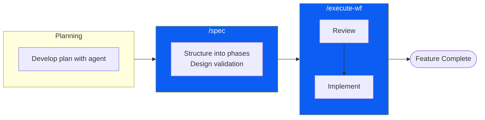
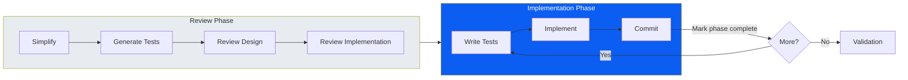

# vd_workflow

A Claude Code plugin for **verification-driven development**—define what "right" looks like, let the agent iterate until criteria are met.

> This plugin implements the workflows described in [Verification-Driven Agentic Coding](https://jyaunches.github.io/blog/practical-agentic-coding). Read that article for the full philosophy; this README covers practical usage.

---

## Quick Start

```bash
# 1. Install the plugin
/plugin marketplace add jyaunches/vd_workflow

# 2. Create your first spec (assumes your context window contains discussion about the feature, 
# maybe even a plan file from plan mode, use the string argument to pass in any additional instructions)
/vd_workflow:spec my-feature "Additional instructions for spec creation"
```

---

## The Two Core Workflows

This plugin provides two main commands that encode the verification-driven approach:



### `/spec` — Plan and Structure

Creates a specification file with phases, acceptance criteria, and a validation strategy.

```bash
/vd_workflow:spec feature-name "Additional instructions for spec creation"
```

**What happens:**
1. Analyzes your codebase structure
2. Generates a spec file in `specs/` with:
   - Overview & objectives
   - Current state analysis
   - Architecture design (conceptual, no code)
   - Implementation phases with acceptance criteria
   - "Clean the House" phase for documentation
3. Runs validation design Q&A to plan E2E verification

**Output:** `specs/YYYY-MM-DD_HH-mm_feature-name.md`

---

### `/execute-wf` — Review and Implement

Takes a spec file and executes the full workflow: review, then implement.

```bash
/vd_workflow:execute-wf specs/my-feature.md
```

**What happens:**



#### Review Phase (automatic)

The review phase verifies your spec against standards defined in `PATTERNS.md`:

A description of what my PATTERNS.md drives for my planning workflow (these should be treated like a living document, getting refined overtime):

| Step | What it verifies |
|------|------------------|
| **Simplify** | No over-engineering, YAGNI enforced |
| **Generate Tests** | Creates test spec file |
| **Review Design** | Alignment with codebase patterns |
| **Review Implementation** | Clarity, completeness, feasibility |

Safe changes are auto-applied; architectural decisions pause for your approval.

#### Implementation Phase (TDD loop)

For each phase in the spec:
1. Write failing tests (verification criteria)
2. Implement until tests pass
3. Commit with `[COMPLETED: git-sha]` marker in spec

The git SHA serves as a checkpoint—if context resets, the agent resumes from the last completed phase.

---

## Customizing Verification Criteria

The plugin includes `shared_docs/PATTERNS.md` which encodes what gets verified during review. Default criteria:

- **Simplicity** — No speculative abstractions
- **Architectural consistency** — Follow existing patterns
- **Test coverage** — Unit tests for each phase
- **No backward compatibility hacks** — Direct integration
- **Clean documentation** — Keep README/CLAUDE.md current

Edit `PATTERNS.md` to tune verification to your team's standards. See the [blog article appendix](https://jyaunches.github.io/blog/practical-agentic-coding#appendix-tuning-your-verification-criteria) for examples.

---

## Utility Commands

These commands support the workflow but aren't the core workflow themselves.

| Command | Purpose |
|---------|---------|
| `/vd_workflow:bug` | Fix a bug using TDD methodology |
| `/vd_workflow:fix-tests` | Run tests and fix failures |
| `/vd_workflow:git-session-cleanup` | Clean up temporary files from a session |

---

## Installation

### From GitHub (Recommended)

Add to your project's `.claude/settings.json`:

```json
{
  "extraKnownMarketplaces": {
    "vd_workflow": {
      "source": {
        "source": "github",
        "repo": "jyaunches/vd_workflow"
      }
    }
  },
  "enabledPlugins": {
    "vd_workflow@vd_workflow": true
  }
}
```

Or via CLI:

```bash
/plugin marketplace add jyaunches/vd_workflow
```

### Local Development

```bash
git clone git@github.com:jyaunches/vd_workflow.git ~/Development/vd_workflow
```

Then in your project's `.claude/settings.json`:

```json
{
  "extraKnownMarketplaces": {
    "vd_workflow": {
      "source": {
        "source": "directory",
        "path": "~/Development/vd_workflow"
      }
    }
  },
  "enabledPlugins": {
    "vd_workflow@vd_workflow": true
  }
}
```

### Updating

Plugin updates require cache clearing:

```bash
rm -rf ~/.claude/plugins/cache/
# Restart Claude Code
```

---

## Reference

### Command Hierarchy

```
/vd_workflow:
├── spec                    # Create specification
│   └── :design-validation  # Design validation strategy
│
├── execute-wf              # Run full workflow
│   ├── :spec-simplify      # Simplify spec (YAGNI)
│   ├── :spec-tests         # Generate test spec
│   ├── :spec-review-design # Review design patterns
│   ├── :spec-review-implementation  # Review implementation
│   ├── :implement-phase    # Implement single phase (TDD)
│   ├── :check-work         # Validate acceptance criteria
│   └── :take-recommendations  # Apply review recommendations
│
├── bug                     # Fix bug with TDD
├── fix-tests               # Run and fix tests
└── git-session-cleanup     # Clean temporary files
```

### Agents

| Agent | Purpose |
|-------|---------|
| `review-executor` | Orchestrates review phase |
| `feature-writer` | Implements phases with TDD |

### Skills

| Skill | Purpose |
|-------|---------|
| `validation-expert` | Validation tool catalog and patterns |
| `plugin-marketplace` | Claude Code plugin system reference |

---

## License

MIT License
